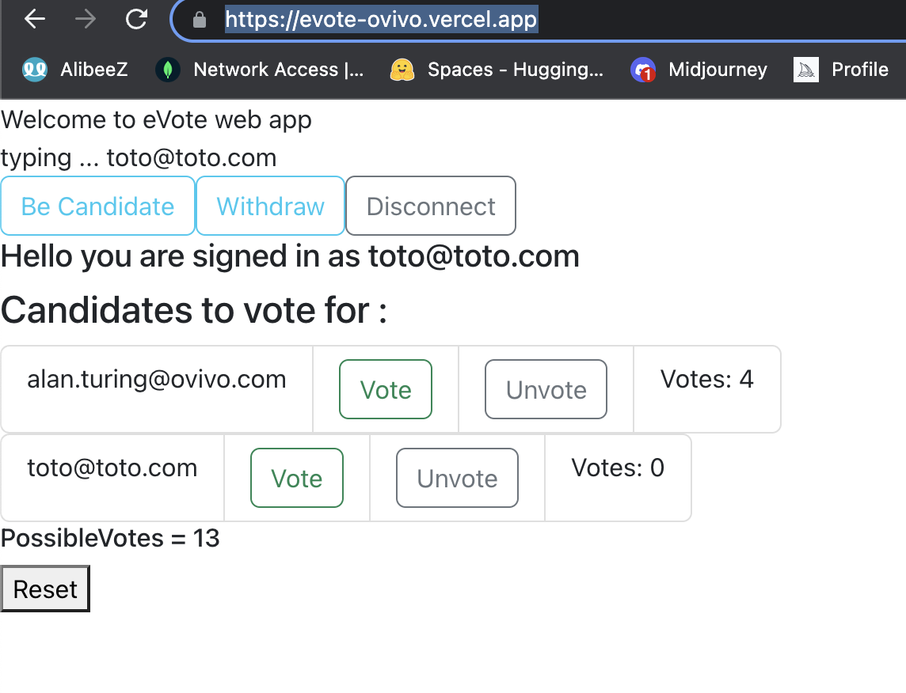

# eVote: An OVIVO Interview Project

Application available : https://evote-ovivo.vercel.app/

## Description

eVote is a web-based application for e-voting, where users can register and vote for each other. This application was built as an interview project for the OVIVO company.

The application was built using React.js, Express, MongoDB (mongoose), and Bootstrap CSS. The server is run using Node.js.

## Features

- User registration using email
- Users can add themselves to the voting list (become a candidate)
- Users can take themselves off the voting list
- Users cannot vote for themselves
- Candidates cannot vote
- Users can vote once per candidate, with a maximum of two candidates
- Users can change their vote at any time
- Display list of registered users along with vote count
- Display remaining possible votes

## Usage

To run the server in root folder:
`nodemon server.js`

To run the client from 'client' folder:

`cd client npm start`

## Data Structure

The data is defined in MongoDB and stored as module variables in the "data" folder. The model is defined in 'models/users.js'. A user consists of:

- email: Unique identifier of the user (string)
- votes: The number of votes received (integer)
- candidate: Is a candidate or not (boolean)
- voted_for: Candidates the user voted for (array)

Input validation is performed at the server level using the Joi library.

### Default users:

sean.carroll@ovivo.com ==> candidate + default 2 votes
dayyani.basel@ovivo.com ==> candidate + default 2 votes
alan.turing@ovivo.com ==> candidate + default 2 votes
ray.dalio@ovivo.com
martin.scorsese@ovivo.com
hans.zimmer@ovivo.com

## Branches

Two branches are maintained:

- 'main': For local testing
- 'deployment': For deploying the app to a service provider (Vercel)

## Notes

This is my first project in React.js. Understanding rapidly useState, useEffect, props state management, and the React gotchas while coding was challenging, as was adapting to the JavaScript syntax.

While the code isn't yet optimized, I'm confident that with more time and learning of the other concepts, improvements can be made.

The code was tested locally without unit testing, something which I plan to learn and implement properly given more time.

I was unable to implement any design patterns as I was focused on finishing the project on time.

## Contributing

Pull requests are welcome. For major changes, please open an issue first to discuss what you would like to change.
